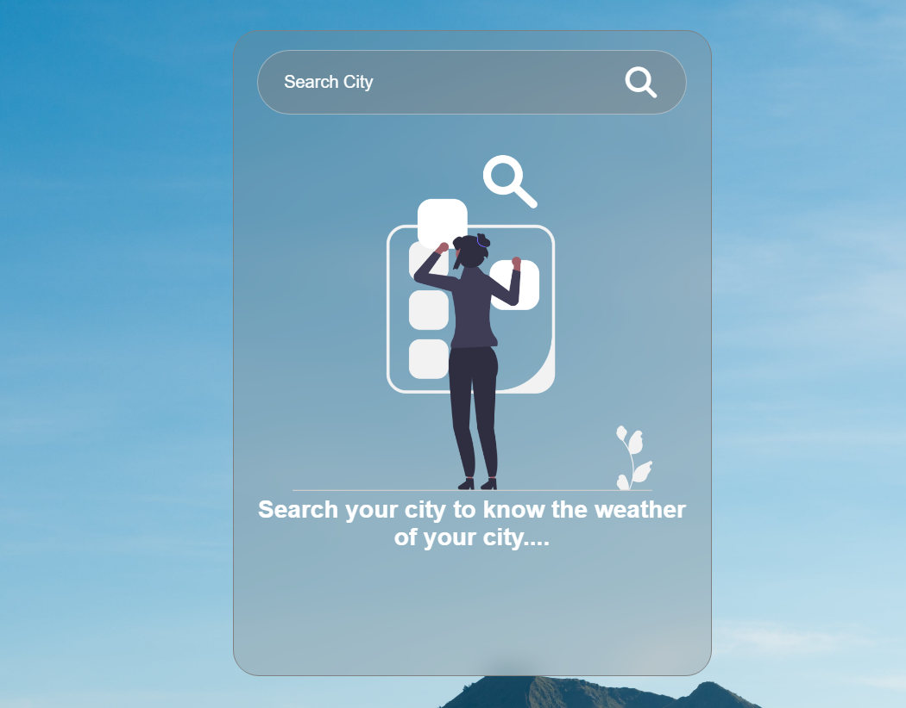
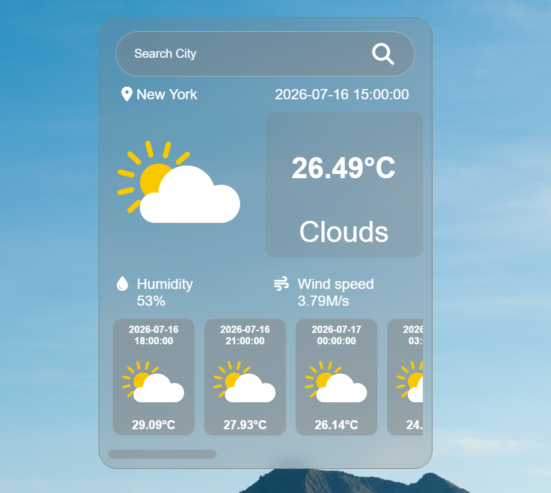
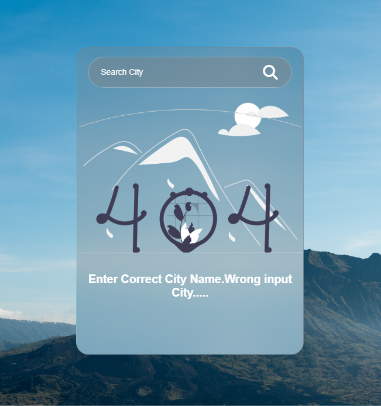

# 🌦️ Weather Forecast App

A modern weather application built using **HTML, CSS, and JavaScript** that fetches real-time weather data from the **OpenWeatherMap API**. Search any city to view the current weather conditions along with a multi-day forecast through a clean and responsive interface.

---
## 🛠 Tech Stack


---

## 📸 Screenshots

| Search | Weather | Not Found |
|--------|---------|-----------|
| || |

---

## 🚀 Live Demo


[](https://masgharimamsyed-prog.github.io/Weather-App/)

---

## ✨ Features

- 🔍 Search weather by city name
- 🌡️ Current temperature
- 📍 City location
- 📅 Date & Time
- 💧 Humidity
- 🌬️ Wind Speed
- 🌤️ Dynamic weather icons
- 📆 10 Forecast Cards
- ❌ 404 City Not Found screen
- 📱 Responsive UI

---


## 📂 Project Structure

```text
Weather-App/
│── index.html
│── style.css
│── app.js
│── README.md
│
├── clear.svg
├── clouds.svg
├── drizzle.svg
├── rain.svg
├── atmosphere.svg
├── search-city.png
├── not-found.png
└── bg.jpg
```

---

## 🚀 Getting Started

```bash
git clone https://github.com/masgharimamsyed-prog/Weather-App.git

cd Weather-App

open index.html
```

---

## 📡 API Used

**OpenWeatherMap Forecast API**

https://openweathermap.org/forecast5

---

## 📚 What I Learned

- Fetch API
- Async / Await
- Working with JSON data
- Error handling
- DOM Manipulation
- Dynamic UI updates
- Weather condition mapping
- API integration

---

## 🚀 Future Improvements

- 🌍 Auto-detect user location
- 📅 5-Day grouped forecast
- 🌙 Dark / Light mode
- 🌡 Unit conversion (°C / °F)
- ❤️ Favorite cities
- ⏳ Loading animation

---

# 👨‍💻 Connect With Me

[](https://github.com/masgharimamsyed-prog)

[](https://www.linkedin.com/in/asghar-imam/)

[](https://leetcode.com/u/CCcXCsREUy/)

---

## ⭐ Support
Made with &#10084; by Asghar

If you found this project helpful, please consider giving it a **⭐ Star**.


